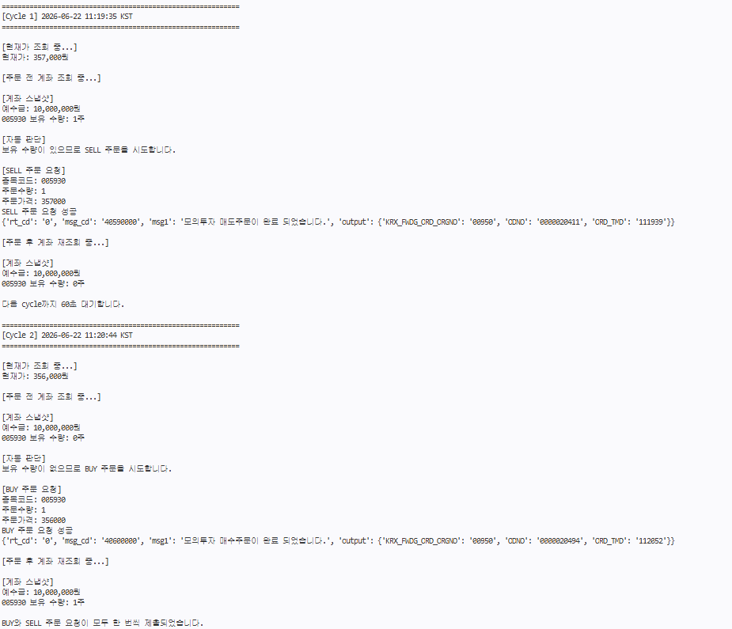
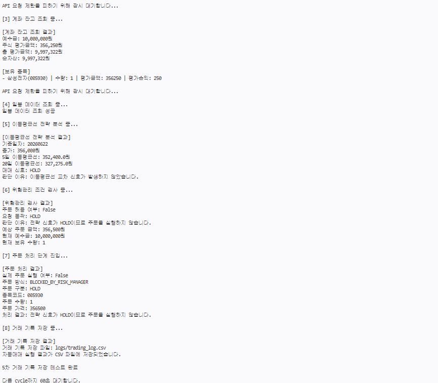

# KIS 자동매매 시스템

## 1. 프로젝트 개요

이 프로젝트는 한국투자증권 Open API를 이용하여 모의투자 환경에서 작동하는 자동매매 시스템을 구현한 프로젝트이다.

프로그램은 한국투자증권 모의투자 API 서버에 접속하여 OAuth access token을 발급받고, 국내주식 현재가, 계좌 잔고, 일봉 데이터를 조회한다. 이후 조회한 일봉 데이터를 바탕으로 이동평균선 전략을 적용하여 `BUY`, `SELL`, `HOLD` 신호를 생성하고, 위험관리 조건을 통과한 경우 주문 처리 단계로 진입한다.

또한 실제 모의투자 환경에서 `BUY`와 `SELL` 주문 요청이 모두 정상적으로 처리되는지 확인하기 위해 별도의 실시간 주문 테스트 파일인 `trader.py`를 추가하였다.

이 repository는 인공지능과 금융공학 Final Project 제출을 위해 작성되었다.

---

## 2. 프로젝트 목표

이 프로젝트의 목표는 단순히 API 요청 예제를 실행하는 것이 아니라, 자동매매 시스템의 전체 흐름을 직접 구현하고 검증하는 것이다.

구현 목표는 다음과 같다.

1. OAuth access token 발급
2. 국내주식 현재가 조회
3. 모의투자 계좌 잔고 조회
4. 국내주식 일봉 데이터 조회
5. 이동평균선 기반 `BUY` / `SELL` / `HOLD` 신호 생성
6. 주문 전 위험관리 조건 확인
7. 모의투자 주문 요청 처리
8. 실제 모의투자 `BUY` / `SELL` 주문 요청 검증
9. 주문 전후 계좌 상태 재조회
10. API 요청 제한, 주문 실패, 장 종료 등 예외 상황 처리
11. 실행 결과 및 거래 기록 저장
12. README에 구현 과정과 실행 결과 정리

---

## 3. 프로젝트 구조

```text
final_project/kis_auto_trading/
├── main.py
├── trader.py
├── kis_api.py
├── strategy.py
├── risk_manager.py
├── logger.py
├── requirements.txt
├── .env.example
├── .gitignore
├── images/
│   └── kis_buy_sell_result.png
└── README.md
```

---

## 4. 파일 설명

| 파일                 | 설명                                                                                                 |
| ------------------ | -------------------------------------------------------------------------------------------------- |
| `main.py`          | 이동평균선 전략 기반 자동매매 흐름을 실행하는 메인 파일이다. 현재가 조회, 잔고 조회, 일봉 데이터 조회, 전략 판단, 위험관리, 주문 처리, 로그 저장을 순서대로 수행한다. |
| `trader.py`        | 실제 모의투자 환경에서 현재가와 계좌 상태를 반복 조회하고, `BUY` / `SELL` 주문 요청이 정상적으로 작동하는지 검증하는 실시간 주문 테스트 파일이다.          |
| `kis_api.py`       | 한국투자증권 Open API와 통신하는 기능을 담당한다. token 발급, 현재가 조회, 잔고 조회, 일봉 조회, hashkey 생성, 주문 요청 기능을 포함한다.        |
| `strategy.py`      | 매매 전략을 담당한다. 5일 이동평균선과 20일 이동평균선을 이용한 moving average crossover 전략을 구현하였다.                          |
| `risk_manager.py`  | 주문 실행 전 위험관리 조건을 확인한다. 예수금 부족, 보유 수량 부족, 중복 매수, `HOLD` 신호 등을 검사한다.                                 |
| `logger.py`        | 전략 판단 결과, 위험관리 결과, 주문 처리 결과를 CSV 파일로 저장한다.                                                         |
| `requirements.txt` | 실행에 필요한 Python package 목록을 정리한 파일이다.                                                               |
| `.env.example`     | 필요한 환경변수 형식을 보여주는 예시 파일이다. 실제 API key는 포함하지 않는다.                                                   |
| `.gitignore`       | `.env`, token, log 등 GitHub에 올리면 안 되는 파일을 제외한다.                                                    |
| `images/`          | README에 첨부할 실행 결과 캡처 이미지를 저장하는 폴더이다.                                                               |
| `README.md`        | 프로젝트 설명, 실행 방법, 구현 내용, 실행 결과를 정리한 문서이다.                                                            |

---

## 5. 환경변수 설정

실제 API key, API secret, 계좌번호는 `.env` 파일에 저장한다.

보안을 위해 `.env` 파일은 GitHub에 업로드하지 않는다. 대신 `.env.example` 파일에 필요한 형식만 기록한다.

예시는 다음과 같다.

```env
KIS_BASE_URL=https://openapivts.koreainvestment.com:29443
KIS_APP_KEY=YOUR_APP_KEY
KIS_APP_SECRET=YOUR_APP_SECRET
KIS_ACCOUNT_NO=YOUR_ACCOUNT_NUMBER
KIS_ACCOUNT_PRODUCT_CODE=01
```

각 변수의 의미는 다음과 같다.

| 변수                         | 의미                                                    |
| -------------------------- | ----------------------------------------------------- |
| `KIS_BASE_URL`             | 한국투자증권 API 서버 주소이다. 모의투자 환경에서는 `openapivts` 주소를 사용한다. |
| `KIS_APP_KEY`              | KIS Developers에서 발급받은 App Key이다.                      |
| `KIS_APP_SECRET`           | KIS Developers에서 발급받은 App Secret이다.                   |
| `KIS_ACCOUNT_NO`           | 모의투자 계좌번호 앞 8자리이다.                                    |
| `KIS_ACCOUNT_PRODUCT_CODE` | 계좌 상품 코드이다. 국내주식은 `01`을 사용한다.                         |

본 프로젝트는 실제투자가 아니라 모의투자 환경에서 실행하였다.

---

## 6. 설치 및 실행 방법

필요한 package를 설치한다.

```bash
pip install -r requirements.txt
```

`.env.example`을 참고하여 `.env` 파일을 만든 뒤 실행한다.

이동평균선 전략 기반 자동매매 흐름은 다음 명령어로 실행한다.

```bash
python main.py
```

실제 모의투자 `BUY` / `SELL` 주문 요청 테스트는 다음 명령어로 실행한다.

```bash
python trader.py
```

`main.py`는 이동평균선 전략을 이용해 `BUY` / `SELL` / `HOLD`를 판단하는 파일이고, `trader.py`는 실제 모의투자 환경에서 `BUY`와 `SELL` 주문 요청이 모두 정상적으로 처리되는지 확인하기 위한 파일이다.

---

## 7. 시스템 전체 작동 흐름

이 프로젝트는 크게 두 가지 실행 흐름으로 구성된다.

첫 번째는 `main.py`를 이용한 이동평균선 전략 기반 자동매매 흐름이다.

```text
OAuth access token 발급
→ 현재가 조회
→ 계좌 잔고 조회
→ 일봉 데이터 조회
→ 5일 / 20일 이동평균선 계산
→ BUY / SELL / HOLD 신호 생성
→ 위험관리 조건 검사
→ 주문 처리 또는 주문 차단
→ 거래 기록 저장
```

두 번째는 `trader.py`를 이용한 실제 모의투자 주문 요청 검증 흐름이다.

```text
OAuth access token 발급
→ 현재가 조회
→ 주문 전 계좌 조회
→ 보유 수량 확인
→ BUY 또는 SELL 주문 요청
→ 주문 후 계좌 재조회
→ BUY / SELL 주문 요청 성공 여부 확인
→ 안전 조건에 따라 종료
```

`main.py`는 전략 기반 자동매매 구조를 보여주기 위한 파일이고, `trader.py`는 실제 모의투자 주문 요청이 정상적으로 작동하는지 검증하기 위한 파일이다.

---

## 8. API 연결 테스트

Python 코드 작성 전에 Postman을 이용하여 한국투자증권 Open API 연결을 먼저 확인하였다.

### 8.1 OAuth token 발급

모의투자 환경에서 OAuth token 발급 요청을 실행하였다.

| 항목              | 결과                         |
| --------------- | -------------------------- |
| 환경              | 모의투자                       |
| 요청 결과           | 성공                         |
| access token 저장 | Postman environment 변수에 저장 |
| token 출력 여부     | 보안을 위해 출력하지 않음             |

### 8.2 현재가 조회

국내주식 현재가 조회 API를 테스트하였다.

| 항목           | 내용                                                 |
| ------------ | -------------------------------------------------- |
| API endpoint | `/uapi/domestic-stock/v1/quotations/inquire-price` |
| 종목코드         | `005930`                                           |
| 결과 코드        | `rt_cd = 0`                                        |
| 메시지          | `정상처리 되었습니다.`                                      |

예시 응답은 다음과 같다.

```json
{
  "rt_cd": "0",
  "msg_cd": "MCA00000",
  "msg1": "정상처리 되었습니다.",
  "output": {
    "stck_shrn_iscd": "005930",
    "stck_prpr": "346500",
    "prdy_vrss": "3500",
    "prdy_ctrt": "1.02"
  }
}
```

이를 통해 모의투자 서버와 정상적으로 통신할 수 있음을 확인하였다.

### 8.3 계좌 잔고 조회

모의투자 계좌 잔고 조회 API도 정상적으로 실행되었다.

| 항목           | 결과                                                |
| ------------ | ------------------------------------------------- |
| API endpoint | `/uapi/domestic-stock/v1/trading/inquire-balance` |
| 결과 코드        | `rt_cd = 0`                                       |
| 메시지          | `모의투자 조회가 완료되었습니다.`                               |
| 예수금          | `10,000,000원`                                     |
| 보유 주식        | 없음                                                |

예시 응답은 다음과 같다.

```json
{
  "output1": [],
  "output2": [
    {
      "dnca_tot_amt": "10000000",
      "scts_evlu_amt": "0",
      "tot_evlu_amt": "10000000",
      "nass_amt": "10000000"
    }
  ],
  "rt_cd": "0",
  "msg1": "모의투자 조회가 완료되었습니다."
}
```

### 8.4 Python 코드 실행 결과

Postman에서 먼저 확인한 한국투자증권 Open API 요청을 Python 코드로 옮긴 뒤 `main.py`를 실행하였다.

실행 명령어는 다음과 같다.

```bash
python main.py
```

실행 결과는 다음과 같다.

```text
[1] OAuth access token 발급 중...
Access token 발급 성공
보안을 위해 token 값은 출력하지 않습니다.

[2] 현재가 조회 중...

[현재가 조회 결과]
종목코드: 005930
현재가: 346,500원
전일 대비: -8,500원
등락률: -2.34%

API 요청 제한을 피하기 위해 잠시 대기합니다...

[3] 계좌 잔고 조회 중...

[계좌 잔고 조회 결과]
예수금: 10,000,000원
주식 평가금액: 0원
총 평가금액: 10,000,000원
순자산: 10,000,000원
보유 종목: 없음
```

이를 통해 Python 코드에서도 다음 기능이 정상적으로 작동함을 확인하였다.

1. OAuth access token 발급
2. 국내주식 현재가 조회
3. 모의투자 계좌 잔고 조회
4. 모의계좌 예수금 및 보유 종목 확인

---

## 9. API 연결 과정에서 발생한 오류와 해결

### 9.1 API 요청 제한 오류

처음 Python 코드로 실행했을 때, 현재가 조회 직후 바로 잔고 조회를 실행하면서 다음 오류가 발생하였다.

```text
초당 거래건수를 초과하였습니다.
EGW00201
```

이 오류는 API 요청을 너무 빠르게 연속으로 보냈기 때문에 발생한 것으로 판단하였다.

따라서 현재가 조회와 잔고 조회 사이에 다음 코드를 추가하였다.

```python
time.sleep(1.5)
```

수정 후에는 잔고 조회가 정상적으로 실행되었다. 이 과정을 통해 한국투자증권 Open API에는 짧은 시간 안에 너무 많은 요청을 보내면 제한이 발생할 수 있으며, 자동매매 시스템에서는 API 호출 간격을 조절해야 한다는 점을 확인하였다.

### 9.2 계좌번호 입력 형식 오류

잔고 조회 과정에서 다음 오류도 확인하였다.

```text
ERROR INVALID INPUT_FIELD_SIZE
```

이 오류는 `.env` 파일의 `KIS_ACCOUNT_NO` 값에 계좌번호 전체 또는 잘못된 형식이 입력되었을 때 발생하였다.

한국투자증권 잔고 조회 API에서는 `CANO`에 계좌번호 앞 8자리만 입력해야 하므로, `.env`의 `KIS_ACCOUNT_NO` 값을 Postman에서 사용한 `CANO` 값과 동일하게 수정하였다.

수정 후 계좌 잔고 조회가 정상적으로 성공하였다.

---

## 10. 매매 전략

`main.py`에서는 이동평균선 교차 전략을 사용한다.

사용하는 이동평균선은 다음과 같다.

| 이동평균선     | 의미    |
| --------- | ----- |
| 5일 이동평균선  | 단기 추세 |
| 20일 이동평균선 | 중기 추세 |

매매 신호는 다음 기준으로 생성한다.

| 조건                              | 신호     |
| ------------------------------- | ------ |
| 5일 이동평균선이 20일 이동평균선을 아래에서 위로 돌파 | `BUY`  |
| 5일 이동평균선이 20일 이동평균선을 위에서 아래로 돌파 | `SELL` |
| 명확한 교차 신호가 없음                   | `HOLD` |

이 전략을 선택한 이유는 구조가 단순하면서도, 현재가 조회, 일봉 데이터 조회, 전략 판단, 위험관리, 주문 처리까지 자동매매 시스템의 전체 흐름을 설명하기에 적합하기 때문이다.

### 10.1 이동평균선 전략 실행 결과

`main.py`를 실행하여 일봉 데이터를 조회하고, 5일 이동평균선과 20일 이동평균선을 계산하였다.

실행 결과는 다음과 같다.

```text
[4] 일봉 데이터 조회 중...
일봉 데이터 조회 성공

[5] 이동평균선 전략 분석 중...

[이동평균선 전략 분석 결과]
기준일자: 20260622
종가: 357,750원
5일 이동평균선: 352,750.0원
20일 이동평균선: 327,362.5원
매매 신호: HOLD
판단 이유: 이동평균선 교차 신호가 발생하지 않았습니다.
```

이번 실행에서는 5일 이동평균선이 20일 이동평균선보다 위에 있었지만, 직전 거래일과 현재 거래일 사이에서 새롭게 교차가 발생한 것은 아니었다. 따라서 `BUY` 신호가 아니라 `HOLD` 신호가 생성되었다.

즉, 시스템은 단순히 단기 이동평균선이 장기 이동평균선보다 높다는 이유만으로 매수하지 않고, 새롭게 교차 신호가 발생했는지를 기준으로 판단한다.

---

## 11. 위험관리

자동매매 시스템은 전략 신호를 바로 주문으로 연결하지 않고, `risk_manager.py`에서 먼저 위험관리 조건을 검사한다.

위험관리 규칙은 다음과 같다.

| 조건                                   | 처리       |
| ------------------------------------ | -------- |
| 신호가 `HOLD`인 경우                       | 주문하지 않음  |
| 신호가 `BUY`이지만 주문 금액이 최대 주문 금액을 초과한 경우 | 매수 차단    |
| 신호가 `BUY`이지만 예수금이 부족한 경우             | 매수 차단    |
| 신호가 `BUY`이지만 이미 해당 종목을 보유 중인 경우      | 중복 매수 차단 |
| 신호가 `SELL`이지만 보유 수량이 없는 경우           | 매도 차단    |
| 모든 조건을 통과한 경우                        | 주문 가능    |

이를 통해 자동매매 시스템이 전략 신호만 보고 바로 주문하지 않고, 계좌 상태와 주문 가능 조건을 함께 확인하도록 구성하였다.

### 11.1 위험관리 실행 결과

이동평균선 전략에서 `HOLD` 신호가 생성된 상황에서 위험관리 검사를 실행하였다.

```text
[6] 위험관리 조건 검사 중...

[위험관리 검사 결과]
주문 허용 여부: False
요청 동작: HOLD
판단 이유: 전략 신호가 HOLD이므로 주문을 실행하지 않습니다.
예상 주문 금액: 358,000원
현재 예수금: 10,000,000원
현재 보유 수량: 0
```

예수금은 충분했지만, 전략 신호가 `HOLD`였기 때문에 주문 허용 여부는 `False`로 판단되었다.

이 결과를 통해 자동매매 시스템이 매수 또는 매도할 이유가 없는 상황에서는 불필요한 주문을 실행하지 않는다는 것을 확인하였다.

---

## 12. 주문 처리 방식

주문 처리 방식은 다음과 같이 구분하였다.

| 주문 처리 방식                  | 설명                                      |
| ------------------------- | --------------------------------------- |
| `BLOCKED_BY_RISK_MANAGER` | 전략 신호 또는 위험관리 조건 때문에 주문이 차단된 경우         |
| `DRY_RUN`                 | 주문 조건은 통과했지만 실제 주문을 보내지 않고 테스트만 수행하는 경우 |
| `LIVE_VIRTUAL_ORDER`      | 모의투자 환경에서 실제 주문 요청을 전송한 경우              |
| `ORDER_REQUEST_FAILED`    | 주문 API 요청을 보냈지만 서버에서 실패 응답을 받은 경우       |

### 12.1 HOLD 신호 주문 차단 결과

`FORCE_TEST_SIGNAL = None` 상태에서 실제 전략 결과를 그대로 사용하여 자동매매 시스템을 실행하였다.

```text
[7] 주문 처리 단계 진입...

[주문 처리 결과]
실제 주문 실행 여부: False
주문 방식: BLOCKED_BY_RISK_MANAGER
주문 구분: HOLD
종목코드: 005930
주문 수량: 1
주문 가격: 358000
처리 결과: 전략 신호가 HOLD이므로 주문을 실행하지 않습니다.
```

이번 실행에서는 이동평균선 전략이 `HOLD` 신호를 생성하였고, 주문 처리 단계에서 실제 주문은 실행되지 않았다.

---

## 13. 자동매매 모드와 테스트 모드

본 프로젝트에서는 실제 전략 기반 자동매매 흐름과 테스트용 강제 신호 흐름을 구분하였다.

기본 자동매매 모드는 다음과 같이 설정한다.

```python
DRY_RUN = True
FORCE_TEST_SIGNAL = None
```

이 상태에서는 사용자가 직접 `BUY` 또는 `SELL`을 선택하지 않는다. 대신 코드가 일봉 데이터를 기반으로 이동평균선 전략을 분석하여 자동으로 `BUY`, `SELL`, `HOLD` 중 하나를 결정한다.

```text
일봉 데이터 조회
→ 5일 이동평균선 / 20일 이동평균선 계산
→ 전략에 따라 BUY / SELL / HOLD 판단
→ risk manager에서 주문 가능 여부 검사
→ 주문 처리 단계 진입
```

반면 `FORCE_TEST_SIGNAL`은 실제 자동매매 전략이 아니라 테스트용 옵션이다.

```python
FORCE_TEST_SIGNAL = "BUY"
```

위와 같이 설정하면 실제 전략 결과와 관계없이 `BUY` 주문 흐름을 테스트할 수 있다.

```python
FORCE_TEST_SIGNAL = "SELL"
```

위와 같이 설정하면 실제 전략 결과와 관계없이 `SELL` 주문 흐름을 테스트할 수 있다.

이 옵션을 추가한 이유는 실제 시장 데이터에서는 전략 결과가 `HOLD`로 나오는 경우가 많기 때문이다. 따라서 `BUY`와 `SELL` 주문 처리 로직이 모두 구현되어 있음을 확인하기 위해 테스트용 강제 신호 옵션을 두었다.

---

## 14. DRY_RUN BUY 주문 흐름 테스트

실제 시장 데이터에서는 `HOLD`가 자주 발생할 수 있으므로, `BUY` 주문 흐름이 정상적으로 구현되어 있는지 확인하기 위해 테스트용 강제 신호를 적용하였다.

설정은 다음과 같다.

```python
DRY_RUN = True
FORCE_TEST_SIGNAL = "BUY"
```

이 설정에서는 실제 전략 결과와 관계없이 `BUY` 신호를 강제로 적용한다. 다만 `DRY_RUN = True`이므로 실제 주문 API 요청은 전송하지 않고, 주문이 실행될 예정이었다는 정보만 출력한다.

실행 결과는 다음과 같다.

```text
[TEST MODE] Strategy signal is manually overridden.
original signal: HOLD
forced signal: BUY

[6] 위험관리 조건 검사 중...

[위험관리 검사 결과]
주문 허용 여부: True
요청 동작: BUY
판단 이유: 위험관리 조건을 모두 통과하여 매수 주문이 가능합니다.
예상 주문 금액: 356,000원
현재 예수금: 10,000,000원
현재 보유 수량: 0

[7] 주문 처리 단계 진입...

[주문 처리 결과]
실제 주문 실행 여부: False
주문 방식: DRY_RUN
주문 구분: BUY
종목코드: 005930
주문 수량: 1
주문 가격: 356000
처리 결과: dry_run 모드이므로 실제 주문은 전송하지 않았습니다.
```

이번 테스트에서 위험관리 조건은 모두 통과하였다. 현재 예수금은 `10,000,000원`이고 예상 주문 금액은 `356,000원`이었으므로, 위험관리 기준상 매수 주문이 가능한 상태로 판단되었다.

그러나 `DRY_RUN = True`였기 때문에 실제 주문 API 요청은 전송하지 않았다.

---

## 15. 실제 주문 전 예외 상황 처리

실제 모의투자 주문을 실행하기 전 다음과 같은 예외 상황을 확인하였다.

### 15.1 예수금 부족 상황

테스트용 `BUY` 신호를 강제로 적용했지만, 계좌 예수금이 `0원`으로 확인된 경우가 있었다.

```text
[위험관리 검사 결과]
주문 허용 여부: False
요청 동작: BUY
판단 이유: 예수금이 부족하여 매수 주문을 실행할 수 없습니다.
```

이 경우 주문 처리 단계에서는 실제 주문을 실행하지 않고, 주문 방식은 `BLOCKED_BY_RISK_MANAGER`로 기록하였다.

### 15.2 모의투자 주문 불가 계좌

`DRY_RUN = False` 상태로 주문 API 요청을 보냈지만, 다음 응답을 받은 경우가 있었다.

```text
Order request failed: {'rt_cd': '1', 'msg_cd': '40910000', 'msg1': '모의투자 주문이 불가한 계좌입니다.'}
```

이 오류는 코드 로직보다는 한국투자증권 모의투자 계좌의 주문 가능 여부 또는 KIS Developers 앱과 연결된 계좌 권한 문제로 판단하였다.

### 15.3 모의투자 장종료 상황

모의투자 계좌를 다시 등록한 뒤 주문 API 요청 단계까지 진입했지만, 장 종료 시간에는 다음 응답을 받았다.

```text
Order request failed: {'rt_cd': '1', 'msg_cd': '40580000', 'msg1': '모의투자 장종료 입니다.'}
```

이 경우에도 프로그램이 중단되지 않도록 예외 처리를 하였고, 실패 사유를 주문 처리 결과와 거래 기록에 저장하도록 구현하였다.

---

## 16. 실시간 모의투자 주문 테스트

전략 기반 자동매매 흐름과 별도로, 실제 모의투자 환경에서 `BUY`와 `SELL` 주문 요청이 모두 정상적으로 처리되는지 확인하기 위해 `trader.py`를 작성하였다.

`trader.py`는 현재가와 계좌 상태를 반복적으로 조회하고, 보유 수량에 따라 다음과 같이 주문 요청을 보낸다.

| 조건                    | 동작              |
| --------------------- | --------------- |
| `005930` 보유 수량이 0주    | `BUY` 1주 주문 요청  |
| `005930` 보유 수량이 1주 이상 | `SELL` 1주 주문 요청 |

이 파일은 실제 투자 전략이라기보다, 모의투자 환경에서 `BUY`와 `SELL` 주문 요청이 모두 정상적으로 작동하는지 검증하기 위한 실행 파일이다.

### 16.1 실제 모의투자 BUY / SELL 주문 테스트 결과

실제 모의투자 환경에서 `BUY`와 `SELL` 주문 요청이 모두 성공한 실행 화면은 다음과 같다.


실행 명령어는 다음과 같다.

```bash
python trader.py
```

실행 결과는 다음과 같다.

```text
[1] OAuth access token 발급 중...
Access token 발급 성공
보안을 위해 token 값은 출력하지 않습니다.

============================================================
[Cycle 1] 2026-06-22 11:17:40 KST
============================================================

[현재가 조회 중...]
현재가: 356,750원

[주문 전 계좌 조회 중...]

[계좌 스냅샷]
예수금: 10,000,000원
005930 보유 수량: 1주

[자동 판단]
보유 수량이 있으므로 SELL 주문을 시도합니다.

[SELL 주문 요청]
종목코드: 005930
주문수량: 1
주문가격: 357000
SELL 주문 요청 성공
{'rt_cd': '0', 'msg_cd': '40590000', 'msg1': '모의투자 매도주문이 완료 되었습니다.', 'output': {'KRX_FWDG_ORD_ORGNO': '00950', 'ODNO': '0000020283', 'ORD_TMD': '111745'}}

[주문 후 계좌 재조회 중...]

[계좌 스냅샷]
예수금: 10,000,000원
005930 보유 수량: 0주

다음 cycle까지 60초 대기합니다.

============================================================
[Cycle 2] 2026-06-22 11:18:47 KST
============================================================

[현재가 조회 중...]
현재가: 357,000원

[주문 전 계좌 조회 중...]

[계좌 스냅샷]
예수금: 10,000,000원
005930 보유 수량: 0주

[자동 판단]
보유 수량이 없으므로 BUY 주문을 시도합니다.

[BUY 주문 요청]
종목코드: 005930
주문수량: 1
주문가격: 357000
BUY 주문 요청 성공
{'rt_cd': '0', 'msg_cd': '40600000', 'msg1': '모의투자 매수주문이 완료 되었습니다.', 'output': {'KRX_FWDG_ORD_ORGNO': '00950', 'ODNO': '0000020372', 'ORD_TMD': '111855'}}

[주문 후 계좌 재조회 중...]

[계좌 스냅샷]
예수금: 10,000,000원
005930 보유 수량: 1주

BUY와 SELL 주문 요청이 모두 한 번씩 제출되었습니다.
안전을 위해 자동매매를 종료합니다.

KIS 실시간 자동매매 trader가 종료되었습니다.
```

이번 실행에서는 실제 모의투자 주문 API 요청을 통해 `SELL`과 `BUY` 주문이 모두 성공하였다.

첫 번째 cycle에서는 계좌에 삼성전자 `005930` 보유 수량이 `1주` 있었기 때문에 자동매매 시스템은 `SELL` 주문을 시도하였다. 주문 가격은 호가단위에 맞게 `357,000원`으로 설정되었고, 한국투자증권 Open API 서버는 `모의투자 매도주문이 완료 되었습니다.`라는 성공 응답을 반환하였다.

주문 후 계좌를 다시 조회한 결과, 삼성전자 보유 수량은 `0주`로 변경되었다.

두 번째 cycle에서는 삼성전자 보유 수량이 `0주`였기 때문에 자동매매 시스템은 `BUY` 주문을 시도하였다. 주문 가격은 `357,000원`, 주문 수량은 `1주`였으며, 한국투자증권 Open API 서버는 `모의투자 매수주문이 완료 되었습니다.`라는 성공 응답을 반환하였다.

주문 후 계좌를 다시 조회한 결과, 삼성전자 보유 수량은 다시 `1주`로 변경되었다.

이번 테스트를 통해 다음 사항을 확인하였다.

| 항목                    | 결과    |
| --------------------- | ----- |
| OAuth access token 발급 | 성공    |
| 현재가 조회                | 성공    |
| 주문 전 계좌 조회            | 성공    |
| SELL 주문 요청            | 성공    |
| SELL 주문 후 보유 수량 감소 확인 | 성공    |
| BUY 주문 요청             | 성공    |
| BUY 주문 후 보유 수량 증가 확인  | 성공    |
| 주문 후 계좌 재조회           | 성공    |
| BUY / SELL 주문 흐름 검증   | 완료    |
| 안전 종료 조건              | 정상 작동 |



---

## 17. 호가단위 오류 처리

실제 주문 테스트 과정에서 다음 오류가 한 차례 발생하였다.

```text
모의투자 주문처리가 안되었습니다(호가단위 오류)
```

이 오류는 주문 가격이 국내주식 호가단위에 맞지 않아 발생하였다. 예를 들어 삼성전자처럼 20만 원 이상 50만 원 미만 가격대의 종목은 500원 단위의 주문 가격을 사용해야 한다.

따라서 `trader.py`에 가격대별 호가단위를 계산하고, 주문 가격을 호가단위에 맞게 조정하는 함수를 추가하였다.

```python
def get_tick_size(price: int) -> int:
    if price < 2000:
        return 1
    if price < 5000:
        return 5
    if price < 20000:
        return 10
    if price < 50000:
        return 50
    if price < 200000:
        return 100
    if price < 500000:
        return 500

    return 1000
```

주문 가격은 매수와 매도 방향에 따라 다음과 같이 조정하였다.

```python
def adjust_price_to_tick(price: int, side: str) -> int:
    tick_size = get_tick_size(price)

    if side == "BUY":
        return (price // tick_size) * tick_size

    if side == "SELL":
        return ((price + tick_size - 1) // tick_size) * tick_size

    return price
```

이후 주문 가격이 호가단위에 맞게 조정되었고, 실제 모의투자 `BUY`와 `SELL` 주문 요청이 모두 성공하였다.

---

## 18. 거래 기록 저장

자동매매 시스템의 실행 결과는 `logger.py`를 통해 CSV 파일에 저장된다.

저장 위치는 다음과 같다.

```text
logs/trading_log.csv
```

저장되는 주요 항목은 다음과 같다.

| 항목                | 설명                     |
| ----------------- | ---------------------- |
| `datetime`        | 자동매매 시스템 실행 시각         |
| `strategy_date`   | 전략 판단 기준일              |
| `stock_code`      | 분석 및 주문 대상 종목 코드       |
| `close_price`     | 전략 판단에 사용된 종가          |
| `ma_short`        | 5일 이동평균선               |
| `ma_long`         | 20일 이동평균선              |
| `strategy_signal` | BUY / SELL / HOLD 신호   |
| `strategy_reason` | 전략 판단 이유               |
| `risk_allowed`    | 위험관리 단계에서 주문을 허용했는지 여부 |
| `risk_reason`     | 위험관리 판단 이유             |
| `order_executed`  | 실제 주문 실행 여부            |
| `order_mode`      | 주문 처리 방식               |
| `order_side`      | BUY / SELL / HOLD      |
| `order_quantity`  | 주문 수량                  |
| `order_price`     | 주문 가격                  |
| `order_message`   | 주문 처리 결과 메시지           |

실제 주문이 발생한 경우뿐만 아니라, `HOLD`로 주문이 차단된 경우와 `DRY_RUN` 테스트 결과도 기록할 수 있도록 구현하였다.

---

## 19. 안전장치

실제 모의투자 주문이 반복적으로 실행되는 것을 방지하기 위해 여러 안전장치를 두었다.

| 안전장치                  | 설명                                               |
| --------------------- | ------------------------------------------------ |
| 모의투자 환경 사용            | `.env`에서 `openapivts` 모의투자 서버를 사용한다.             |
| API key 비공개           | `.env` 파일을 `.gitignore`에 포함하여 GitHub에 업로드하지 않는다. |
| Access token 비공개      | access token 발급 성공 여부만 출력하고 token 값은 출력하지 않는다.   |
| DRY_RUN 모드            | 실제 주문 전송 없이 주문 흐름을 검증할 수 있다.                     |
| 주문 수량 제한              | 실제 주문 테스트에서는 `ORDER_QUANTITY = 1`로 설정하였다.        |
| 반복 횟수 제한              | `MAX_CYCLES`를 두어 무한 반복을 방지하였다.                   |
| 반복 간격 설정              | API 요청 제한을 피하기 위해 cycle 사이에 대기 시간을 두었다.          |
| BUY / SELL 1회 성공 후 종료 | 매수와 매도 주문 요청이 모두 한 번씩 제출되면 자동 종료되도록 하였다.         |
| 주문 실패 예외 처리           | 주문 실패 응답이 발생해도 프로그램이 중단되지 않고 실패 사유를 출력하도록 하였다.   |

---

## 20. 코드 구조 및 주요 기능

### 20.1 `main.py`

`main.py`는 자동매매 시스템의 전체 실행 흐름을 담당한다.

주요 역할은 다음과 같다.

1. 환경변수 로드
2. KIS API client 생성
3. access token 발급
4. 현재가 조회
5. 계좌 잔고 조회
6. 일봉 데이터 조회
7. 이동평균선 전략 분석
8. 테스트용 강제 신호 적용 여부 확인
9. 위험관리 조건 검사
10. 주문 처리
11. 거래 기록 저장

즉, `main.py`는 각각의 모듈을 연결하여 하나의 자동매매 흐름으로 실행하는 중심 파일이다.

### 20.2 `trader.py`

`trader.py`는 실제 모의투자 환경에서 `BUY`와 `SELL` 주문 요청이 모두 정상적으로 작동하는지 확인하기 위한 실시간 주문 테스트 파일이다.

`trader.py`는 현재가와 계좌 상태를 반복적으로 조회하고, 보유 수량에 따라 다음과 같이 동작한다.

| 조건                    | 동작              |
| --------------------- | --------------- |
| `005930` 보유 수량이 0주    | `BUY` 1주 주문 요청  |
| `005930` 보유 수량이 1주 이상 | `SELL` 1주 주문 요청 |

이 파일은 실제 투자 수익률을 높이기 위한 전략 파일이라기보다, 모의투자 환경에서 매수와 매도 주문 요청 기능이 모두 작동하는지 검증하기 위한 파일이다.

### 20.3 `kis_api.py`

`kis_api.py`는 한국투자증권 Open API와 직접 통신하는 기능을 담당한다.

주요 기능은 다음과 같다.

| 함수                    | 역할                    |
| --------------------- | --------------------- |
| `get_access_token()`  | OAuth access token 발급 |
| `get_current_price()` | 국내주식 현재가 조회           |
| `get_balance()`       | 모의투자 계좌 잔고 조회         |
| `get_daily_prices()`  | 국내주식 일봉 데이터 조회        |
| `create_hashkey()`    | 주문 요청에 필요한 hashkey 생성 |
| `place_order()`       | 모의투자 주문 요청            |

API 통신 코드를 별도 파일로 분리하여, 전략 로직이나 위험관리 로직과 구분하였다.

### 20.4 `strategy.py`

`strategy.py`는 매매 전략을 담당한다.

현재는 5일 이동평균선과 20일 이동평균선을 이용한 moving average crossover 전략을 사용한다.

### 20.5 `risk_manager.py`

`risk_manager.py`는 전략 신호를 실제 주문으로 연결해도 되는지 확인한다.

이 모듈을 통해 자동매매 시스템이 전략 신호만 보고 바로 주문하지 않고, 계좌 상태와 주문 가능 조건을 함께 확인하도록 구현하였다.

### 20.6 `logger.py`

`logger.py`는 자동매매 시스템의 실행 결과를 CSV 파일로 저장한다.

---

## 21. 한계 및 개선 방향

현재 프로젝트는 모의투자 환경에서 자동매매의 기본 흐름을 구현하고, 실제 `BUY` / `SELL` 주문 요청이 가능함을 확인하였다.

다만 다음과 같은 한계가 있다.

1. 실제 수익성을 검증한 전략은 아니다.
2. 이동평균선 전략은 단순한 예시 전략이다.
3. 장기적인 반복 매매 결과를 충분히 누적하지는 못했다.
4. 주문 체결 여부를 더 정밀하게 추적하는 기능은 제한적이다.
5. 여러 종목을 동시에 관리하는 기능은 구현하지 않았다.

개선 방향은 다음과 같다.

1. 주문 체결 조회 기능 추가
2. 목표 수익률과 손절률 기반 매도 조건 추가
3. 여러 종목을 동시에 관리하는 portfolio 기능 추가
4. 장기 모의투자 로그 누적
5. 실시간 가격 변동에 따른 전략 개선
6. 매매 결과 시각화 기능 추가

---

## 22. 참고 자료

* 한국투자증권 Open API
* 한국투자증권 Open API 공식 sample repository
* 인공지능과 금융공학 수업 자료
